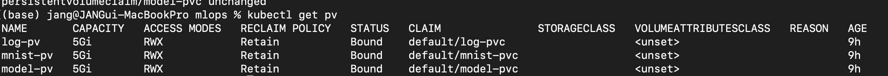
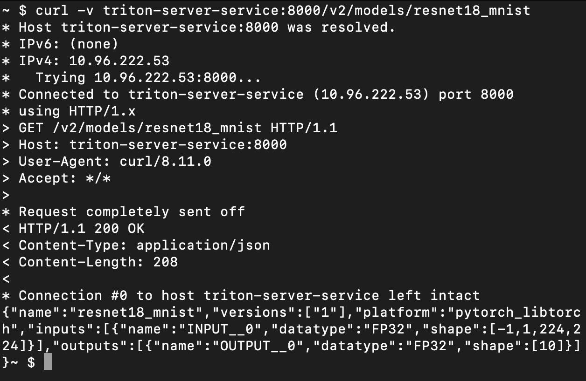

# k8s 인프라 명세서 - 모델 학습 및 배포 시스템 구현
## 디렉터리 구조
```bash
.
├── architecture.pdf : 아키텍처 다이어그램
├── assets : 마크다운 첨부 이미지 폴더
├── build_docker_image.sh : 도커 이미지 빌드 shell 파일
├── inference_model [추론 grpc 클라이언트 폴더]
│   ├── Dockerfile : 추론 클라이언트 이미지 빌드용 Dockerfile
│   ├── inference.py : 추론 애플리케이션 코드 파일
│   ├── inference_images : 추론 예시 이미지(10개 파일) 폴더
│   ├── logger.py : 로거 파일
│   └── requirements.txt : 필요 패키지 requirements 파일
├── k8s_yaml [k8s manifest]
│   ├── 1-pv.yaml
│   ├── 2-pvc.yaml
│   ├── 3-triton-server-deployment.yaml
│   ├── 3-triton-server-service.yaml
│   ├── 4-train-configmap.yaml
│   ├── 4-train-model-job.yaml
│   └── 5-inference-pod.yaml
├── readme.md : k8s 인프라 명세서
└── train_model : [모델 학습 Job 폴더]
    ├── Dockerfile : 모델 학습 이미지 빌드용 Dockerfile
    ├── logger.py : 로거 파일
    ├── requirements.txt : 필요 패키지 requirements 파일
    └── train_model.py : 모델 학습 애플리케이션 코드 파일
```
## 사전 환경 설정

- 수행 환경: Apple M3 Pro(11core cpu, 16gb ram, 1TB ssd)
- Docker Desktop 설치([https://docs.docker.com/desktop/setup/install/mac-install/](https://docs.docker.com/desktop/setup/install/mac-install/))

### Minikube 설치

```bash
curl -LO https://storage.googleapis.com/minikube/releases/latest/minikube-darwin-arm64
sudo install minikube-darwin-arm64 /usr/local/bin/minikube
```

### Minikube 실행

- cpu 4 core, memory 8g, disk 50g

```bash
minikube start --cpus=4 --memory=8192 --disk-size=50g
```


### Docker Image Build

프로젝트 루트 경로에서 접근 후 `build_docker_image.sh` 실행

```bash
bash build_docker_image.sh
```


## k8s 인프라 구성

### pv, pvc 설정

1. minikube 컨테이너 내부 경로 설정 (pv 경로)

```bash
docker exec -it minikube /bin/bash -c "
    mkdir -p /mnt/data/models &&
    mkdir -p /mnt/data/mnist &&
    mkdir -p /mnt/data/logs
"
```

2. pv 생성
```bash
kubectl apply -f k8s_yaml/1-pv.yaml
```
- 생성된 리소스 확인
`kubectl get pv`


3. pvc 생성

```bash
kubectl apply -f k8s_yaml/2-pvc.yaml
```
- 생성된 리소스 확인
    `kubectl get pvc`

    
    
### Triton Server 설정

```bash
kubectl apply -f k8s_yaml/3-triton-server-service.yaml
kubectl apply -f k8s_yaml/3-triton-server-deployment.yaml
```


- 생성된 리소스 확인
    1. 서비스 확인 `kubectl get svc`
        
    2. 디플로이먼트 확인 `kubectl get deployment` (초기 구축시 이미지 pulling 작업으로 생성 완료까지 약 5분 소요)
        
        


### 학습 Job 실행

```bash
kubectl apply -f k8s_yaml/4-train-configmap.yaml
kubectl apply -f k8s_yaml/4-train-model-job.yaml
```


- 학습 결과 로그 확인
    
    minikube 컨테이너의 /mnt/data/logs 폴더의 학습 로그 확인
    
    ```bash
    # minikube 컨테이너 실행
    docker exec -it minikube /bin/bash
    # 로그 경로 접근
    cd /mnt/data/logs
    # 로그 파일 확인
    cat train_model_[실행날짜].txt
    ```
    
    

<details>
<summary>학습된 모델 확인(curl 요청 활용)</summary>
curl 요청을 수행하여 배포된 모델의 정보를 확인할 수 있습니다.
    
```bash
# curl 명령 수행을 위한 임시 curl 파드 생성
kubectl run curl -it --rm --image curlimages/curl -- sh
```

curl pod 내부에서 아래 명령어 실행

```bash
# 학습 모델 조회
curl -v triton-server-service:8000/v2/models/resnet18_mnist
```


</details>

### 추론용 grpc client pod 실행

- 추론용 이미지 파일 minikube 컨테이너로 복사

```bash
# 프로젝트 루트 경로에서 실행
# 컨테이너 내부 경로 생성
docker exec minikube mkdir -p /mnt/data/mnist/inference
# inference_images 폴더에 png확장자 외에 불필요한 시스템 파일 제거
find inference_model/inference_images -type f ! -name "*.png" -delete
# 로컬 파일을 컨테이너로 복사
docker cp inference_model/inference_images/. minikube:/mnt/data/mnist/inference
```

- 추론 클라이언트 파드 실행

```bash
kubectl apply -f k8s_yaml/5-inference-pod.yaml
```

- 추론 결과 로그 확인

```bash
# minikube 컨테이너 실행
docker exec -it minikube /bin/bash
# 로그 경로 접근
cd /mnt/data/logs
# 로그 파일 확인
cat inference_[실행날짜].txt
```
